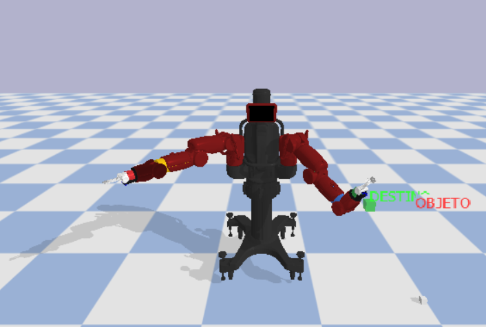
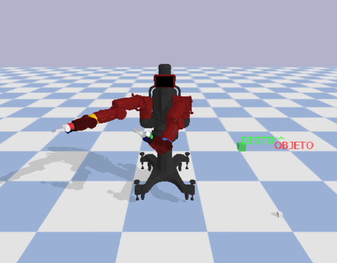

# Elaborado por: 
**Jordan Alejandro Rodirguez Torres**

**Nicolas Robayo Gomez**

**Camilo Molano**

Universidad Militar nueva granada
 
# ==============================================
# Baxter + ESP32 + PyBullet

Proyecto para la **parte b**: consola de mandos con ESP32 para controlar el robot Baxter en PyBullet mediante movimiento cartesiano fluido, cambio de brazo, control de pinza y demostración de pick & place.

## 1. Arquitectura

```text
ESP32
  |
  | USB / Serial 115200
  v
Python
  |
  | velocidad cartesiana X/Y/Z
  v
PyBullet + IK
  |
  v
Baxter
  |
  +--> pinza
  +--> objeto
  +--> destino
```

El controlador usa la cinemática inversa de PyBullet y `POSITION_CONTROL` con una trayectoria suavizada.

## 2. Estructura

```text
BAXTER_ESP32_PYBULLET/
│
├── python/
│   ├── main.py
│   ├── requirements.txt
│   └── .gitignore
│
├── esp32/
│   └── baxter_controller.ino
│
└── README.md
```

## 3. Descargar el modelo Baxter

El proyecto de referencia usado por este trabajo es:

https://github.com/erwincoumans/pybullet_robots

Desde PowerShell:

```powershell
git clone https://github.com/erwincoumans/pybullet_robots.git vendor/pybullet_robots
```

La ruta que debe existir es:

```text
vendor/pybullet_robots/data/baxter_common/baxter_description/urdf/toms_baxter.urdf
```

## 4. Instalar Python

Se recomienda usar un entorno virtual.

```powershell
python -m venv .venv
.\.venv\Scripts\Activate.ps1
pip install -r python/requirements.txt
```

Si PowerShell no permite activar el entorno:

```powershell
Set-ExecutionPolicy -Scope Process Bypass
.\.venv\Scripts\Activate.ps1
```

## 5. ESP32

Abrir:

```text
esp32/baxter_controller.ino
```

Seleccionar la placa ESP32 y cargar el programa a 115200 baudios.

### Conexiones

| Elemento | ESP32 |
|---|---:|
| Joystick X | GPIO 34 |
| Joystick Y | GPIO 35 |
| Potenciómetro Z | GPIO 32 |
| Botón GRIP | GPIO 25 |
| Botón ARM | GPIO 26 |
| GND botones | GND |
| VCC joystick | 3.3 V |
| GND joystick | GND |

**Importante:** las entradas ADC del ESP32 no deben recibir más de 3.3 V.

## 6. Ejecutar sin ESP32

Primero se puede probar todo con el teclado:

```powershell
python python/main.py
```

Controles:

| Tecla | Función |
|---|---|
| Flecha izquierda/derecha | X |
| Flecha arriba/abajo | Y |
| W / S | Z |
| G | Abrir/cerrar pinza |
| O | Abrir pinza |
| C | Cerrar pinza |
| TAB | Cambiar brazo |
| H | Home |
| P | Pick & place |
| ESC | Salir |

## 7. Ejecutar con ESP32

Primero identificar el puerto COM, por ejemplo:

```text
COM5
```

Después:

```powershell
python python/main.py --port COM5
```

Si el puerto es diferente:

```powershell
python python/main.py --port COM7
```

## 8. Funcionamiento

### Movimiento

El joystick no manda directamente ángulos de motores.

Manda:

```text
X -> velocidad cartesiana X
Y -> velocidad cartesiana Y
Z -> velocidad cartesiana Z
```

Python integra esas velocidades para construir una posición objetivo:

```text
target_x
target_y
target_z
```

Luego PyBullet calcula:

```text
posición objetivo
       ↓
Inverse Kinematics
       ↓
ángulos articulares
       ↓
POSITION_CONTROL
       ↓
Baxter
```

Esto permite que el movimiento sea mucho más natural que mandar saltos de ángulo.

### Cambio de brazo

El botón `ARM` cambia entre:

```text
0 -> brazo izquierdo
1 -> brazo derecho
```

El programa localiza automáticamente:

```text
left_s0 ... left_w2
right_s0 ... right_w2
```

y utiliza:

```text
left_gripper
right_gripper
```

como efectores finales.

### Pinza

El botón `GRIP` alterna:

```text
ABIERTA
   ↕
CERRADA
```

La pinza del modelo Baxter utiliza dos articulaciones prismáticas para los dedos.

### Pick & Place

Presionando `P` se ejecuta:

```text
1. Acercarse al objeto
2. Bajar
3. Cerrar pinza
4. Tomar objeto
5. Levantar
6. Desplazarse al destino
7. Bajar
8. Abrir pinza
9. Liberar objeto
```

La demostración utiliza una restricción física temporal para representar el agarre cuando la pinza está cerrada y suficientemente cerca del objeto.

## 9. Qué demuestra el proyecto

La solución cumple los elementos principales de la parte b:

- [x] ESP32 como consola de mandos
- [x] Comunicación USB serial
- [x] Movimiento cartesiano X/Y/Z
- [x] Movimiento suavizado
- [x] Cinemática inversa
- [x] Control del brazo izquierdo
- [x] Control del brazo derecho
- [x] Cambio de brazo
- [x] Apertura/cierre de pinza
- [x] Posicionamiento
- [x] Agarre de objeto
- [x] Movimiento del objeto
- [x] Pick & place
- [x] Simulación en PyBullet

## 10. Comandos rápidos

```powershell
# Activar entorno
.\.venv\Scripts\Activate.ps1

# Instalar dependencias
pip install -r python/requirements.txt

# Ejecutar teclado
python python/main.py

# Ejecutar ESP32
python python/main.py --port COM5
```

## 11 





## 12. Referencia técnica

El proyecto toma como referencia el repositorio `pybullet_robots` de Erwin Coumans, que incluye ejemplos de Baxter e IK para PyBullet.

El modelo `toms_baxter.urdf` contiene las articulaciones de ambos brazos y las articulaciones prismáticas de las pinzas.

Para la presentación, se recomienda explicar:

1. ESP32 adquiere los mandos.
2. Serial transmite los datos.
3. Python recibe X/Y/Z.
4. Se genera una trayectoria cartesiana.
5. PyBullet resuelve la IK.
6. Los motores virtuales siguen los ángulos calculados.
7. La pinza permite tomar el objeto.
8. Se ejecuta el desplazamiento hasta el destino.
